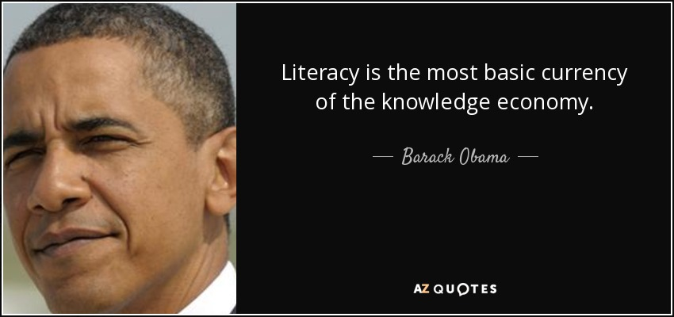

These are just jokes, don't take it seriously

# 
Pantun Marketplace

A pantun sales app allows people to sell and buy pantun

## Why

[TLDR click here for context](https://youtu.be/R6Gm2Ap1zVI)

In Upin Ipin S15E22 (Rajin Menyimpan Bijak Belanja), there's a scene where Upin Ipin's friends chilling in a small shack and each of them showing off their source of income,

 
Ehsan with his video content making...

 
Mei mei helping her mother selling flowers...

 
Susanti also helping her mother baking cakes and pastries...

 
Mail that hustlin' everyday selling chickens and stuff... (mad respect on this dude)

 
And Fizi <strike>with his sugar baby mentality</strike> that always assist his friend ehsan

 
But how is JARJIT ?

 
He GOT his STUFF, but NO MARKET...

 
Therefore, NONE TO BE SELL.

 
 

 

## And so, i began to create this app, that allows MARVELOUS artists like Jarjit and their ARTS, to be APPRECIATED in a way that lets them to GROW MORE.

 
STILL WIP

